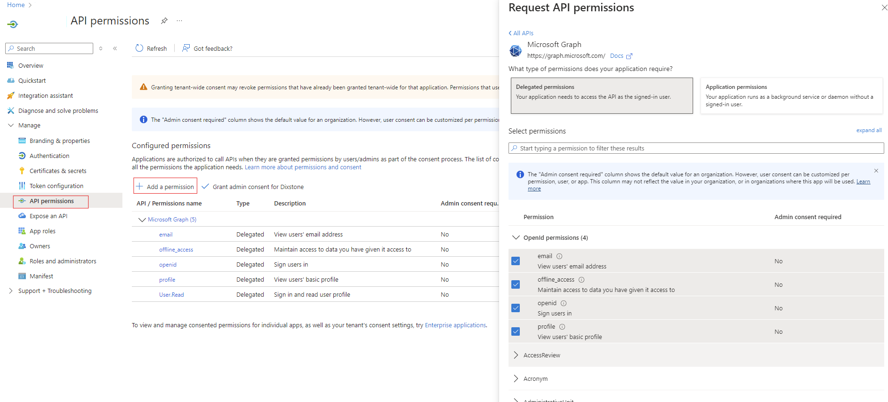

# Django App with Azure AD Authentication

## Overview

This document outlines the setup and implementation of a simple Django application that uses the Azure AD for authentication. The app will provide a basic web interface for user to login.

## Prerequisites

Before you start, ensure you have the following installed:

- Django 5.1.1 was used for this project, and that requires Python 3.10 or higher. 
However, it's advised to use the same version (Python 3.11) that was used for the project to ensure similar experience 

## Installation

1. **Setup your virtual environment and install the packages in requirements.txt**

   Open your terminal and run:

   ```bash
   pip install -r requirements.txt

2. **You need to create an application on Azure for this app to integrate with this app. Follow this [guide] (https://django-auth-adfs.readthedocs.io/en/latest/azure_ad_config_guide.html)**
- Stop at Stage 1 (`Choose Multitenant as supported account types`)
- For a dev environment, use localhost at your preferred port for your redirect url. e.g `http://localhost:3002`
3. 
4. **Grant necessary permissions to your application**
- Following creating secrets in Certificate & secrets in the guide above, take these steps:
- Click `API permissions` > `Add a permission` > `API my organization uses` > `Microsoft Graph` > `Delegated Permissions`
- Select all OpenId permissions and click `add permission`.
- 

4. **Setup the environment variables using a .env file, sample in `.env.sample` **
   ```bash
    ENVIRONMENT=development
    DEBUG= # True or False
    DJANGO_SECRET_KEY=
    CLIENT_ID=
    CLIENT_SECRET=
    TENANT_ID=
   
- DJANGO_SECRET_KEY: A set of characters for Django `SECRET_KEY` value
- CLIENT_ID: Your application's client id from Azure
- TENANT_ID: Your directory id from Azure
- CLIENT_SECRET: Your directory id from Azure

5. **Run migrations and launch the Django app**
    ```bash
   python manage.py makemigrations
   python manage.py migrate
   python manage.py collectstatic --noinput
   python manage.py runserver [port]
- `port` on `python manage.py runserver [port]` must match the port you used on your redirect url on Step 2 above 

6. **Visit http://localhost:[port] (not 127.0.0.1)  and follow the prompt**
**It's essential that the app is launched at the port you specified as redirect url on Azure during your App Registration in step @ above.

**Goodluck**